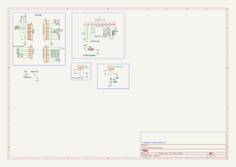
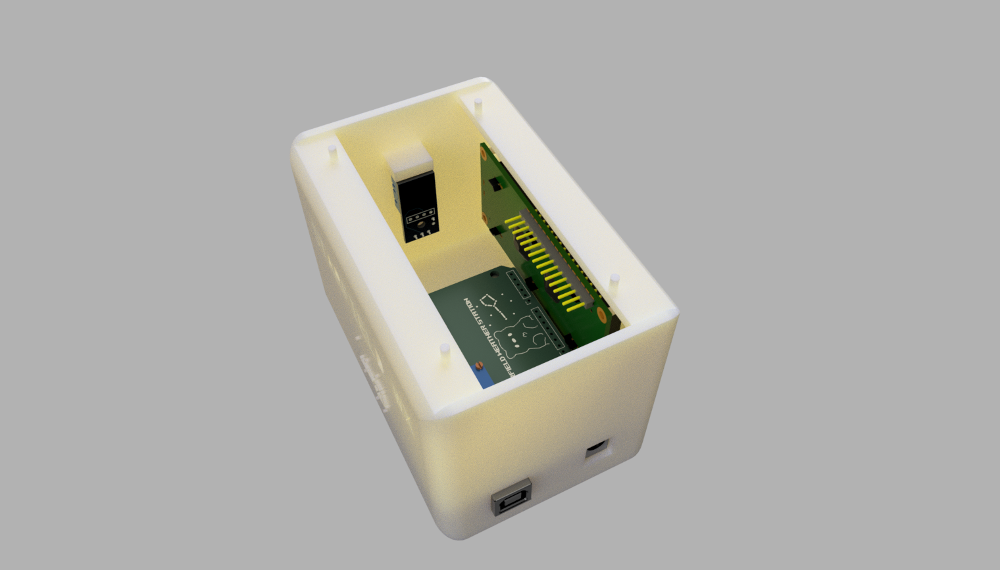

<h1 align="center">StarField WX</h1>

  <i>Portable Arduino‑powered dew‑risk weather station with LCD and LED halo.</i>

---

##  1. What is STARFIELD WX?

Starfield WX is a pocket-sized weather station that tells you when dew is about to become a problem for stargazing/ astrophotography.

---

##  2. Why did I make it?

I love being outside with my telescope, but because of where I live, I always end up with dew messing up my session before I could photograph anything. Starfield WX is my companion project for ORBTIZ. it can warn you about dew forming before it ruins your session.

---

##  3. How does it work?

The brains of the operation is the arduino uno. It:
- Reads temperature and humidity from a DHT11 module.
- Calculates an approximate dew point from those readings.
- Classifies dew risk (LOW, MEDIUM, HIGH) based on the spread between temperature and dew point.
- Shows live values on a 16×2 character LCD while auto‑cycling between temperature, humidity, and dew‑point screens.
- Uses a WS2812B LED halo as a status ring: green for low risk, orange for medium, red when dew is imminent.

---

##  4.Hardware schematic

You can view the full schematic for the ORBITZ PCB below.
  

The custom STARFIELD pcb plugs directly onto an Arduino Uno and breaks out all parts needed for weather station

key pins:
DHT11 data -> Arduino digital pin 2
WS2812B LED strip -> Arduino digital pin 6
1602 LCD (parallel) -> Arduino digital pins 7–12
Trimmer potentiometer -> LCD contrast
Series resistors for the LCD backlight and LED strip data line

you can view the full schematic here.

---

##  5. How do you use it?

Power on the arduino uno via USB or a **5v** supply ( you can also power it using the usb hub on orbitz!!)

StarField WX boots, then starts cycling through three screens on the LCD:
  - Temperature in C
  - Relative humiditry in %
  - Dew point in C
  

The led halo color shows dew risk : green (low), orange ( medium), red (high).
when it turns red, conditions are close to the dew point and you should protect your optics or wrap up the session , unfortunately :( 

## ASSEMBLED DESIGN 
Below is what your fully assembled design should look like.

order all parts from the Starfield BOM
solder headers, resistors, the DHT11 module connector, LCD header, LED strip header to the PCB
Mounts the potentiometer and adjust until the LCD text is clearly visible 
Attach the 1602 LCD to the enclosure using standoffs
cut the WS2812B strip to length and mount it around the inside top of the enclosure, then wire it 5v, GND , and the data pin
Insert the arduino UNO under the shield and secure the PCB in the 3d printed enclosure.
upload the code and enjoy!
---
## 6. Assembly
Below is what the fully assembled design should look like.
1. Order all parts from the Starfield BOM.
2. Solder headers, resistors, the DHT11 module connector, LCD header, LED Strip header to the PCB.
3. Mount the potentiometer and adjust until the LCD text is clearly visible.
4. Attach the 1602 LCD to the enclosure using standoffs.
5. Cut the ws2812b strip to length and mount it arond the inside the top of the enclosure, then wire it to 5v, GND, and the data pin.
6. Insert the shield onto the Arduino Uno and secure the PCB into the enclosure.
7. Upload the code and enjoy!!
   

---

## 7. Firmware
The firmware is a single Arduino sketch that runs on the Uno

Features:

- Periodically reads DHT11 temperature and humidity
- computes dew point using a simple approximation formula
- cycle LCD screens every few seconds (temperature, humidty, dew point)
- computes dew risk catergory and updates the LED halo color

how to flash
1. open firmware/starfield_wx.ino in the arduino uno
2. select arduino uno as the board and choose the correct serial port
3. click upload.
4. after reseting, the splash screen appears, then live readings start
Feel free to tweak the threshold and LED colors to match your local climate and conditions

##  8. Images

<table>
  <tr>
    <td align="center">
      <strong>FINAL PCB SCREENSHOTS</strong>  
      
    </td>
  </tr>
  <tr>
    <td align="center">
      <strong>PCB</strong>  
      
    </td>
  </tr>
  <tr>
    <td align="center">
      <strong>FINAL BUILD</strong>  
      
    </td>
  </tr>
</table>

##  8. Bill of Materials (BOM)

The full detailed BOM is included in this repository:

- [[`/STARFIELD_BILL_OF_MATERIALS.csv`](https://github.com/marvyluvu/Starfield-WX/blob/69a2b140c6205f69048c935fe2e7507fc950f91d/hardware/STARFIELD_BOM.csv)

You can open this file in Excel, Google Sheets, or any spreadsheet tool.
It includes part names, descriptions, quantities, prices, and direct purchase links.

Key components

### Full BOM (summary)

### Full BOM (summary)

| Product name | Description | Qty | Unit price | Link |
|-------------|-------------|-----|-----------|------|
| Arduino Uno | Main microcontroller board | 1 | dh30.90 | [Amazon](https://www.amazon.ae/UNO-ATmega328P-Development-Straight-Developer/dp/B07PFCGYRS/) |
| WS2812B RGB STRIP | led halo indicator | 1 | dh3.75 | [AliExpress](https://ar.aliexpress.com/item/1005005537967685.html) |
| jumper cables | for connecting components internally | 1 | dh12.45 | [AliExpress](https://www.aliexpress.com/ssr/300000512/BundleDeals2?productIds=1005003641187997%3A12000026613929397) |
| STARFIELD custom pcb | main board | 1 | dh108.67 | JLCPCB |
| MALE HEADERS | LED , DHT11 PINS | 1 | dh3.75 | [AliExpress](https://ar.aliexpress.com/item/1005001514058091.html) |
| DHT11 MODULE | HUMIDTY AND TEMP SENSOR | 1 | dh17.48 | [AliExpress](https://ar.aliexpress.com/item/1005012263106656.html) |
| 1602A LCD Display | Main Display | 1 | dh65.88 | [Amazon](https://www.amazon.ae/naughtystarts-Character-Controller-Blacklight-Compatible/dp/B0B1QFDJ3Y/) |
| Trimmer potentiometer | Controls display contrast (3296W-103 10K) | 1 | dh10.90 | [AliExpress](https://ar.aliexpress.com/item/1005012099171886.html) |
| 220 OHM RESISTOR | lcd backlight resistor 220 OHM | 1 | dh3.75 | [AliExpress](https://ar.aliexpress.com/item/1005004002774546.html) |
| 330 OHM RESISTOR | led strip resistor 330 OHM | 1 | dh3.75 | [AliExpress](https://ar.aliexpress.com/item/1005004002774546.html) |
